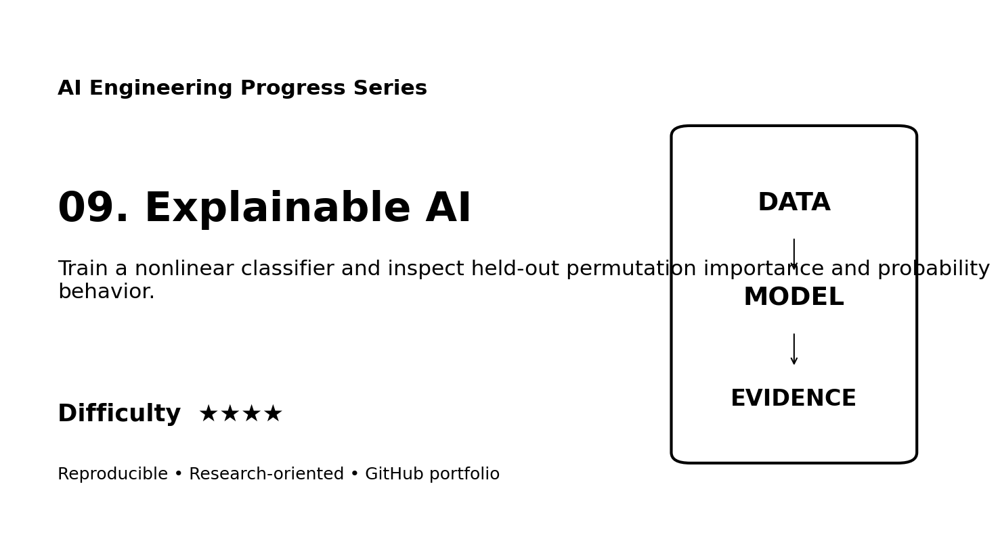
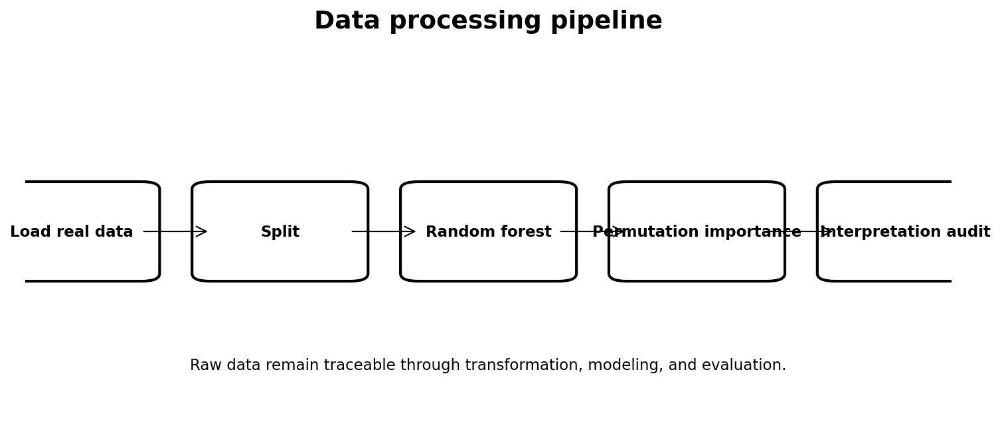
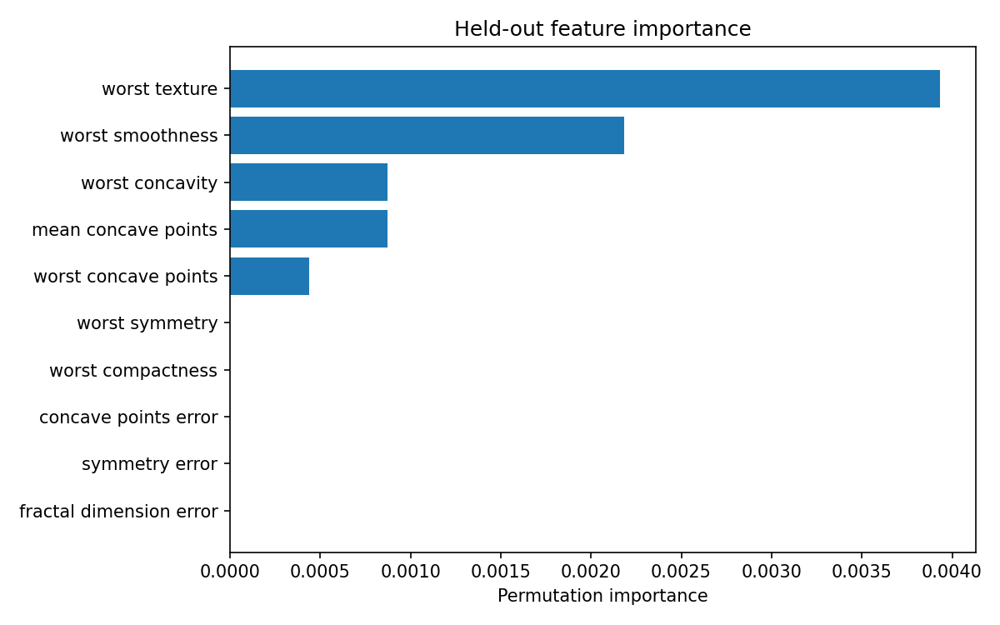
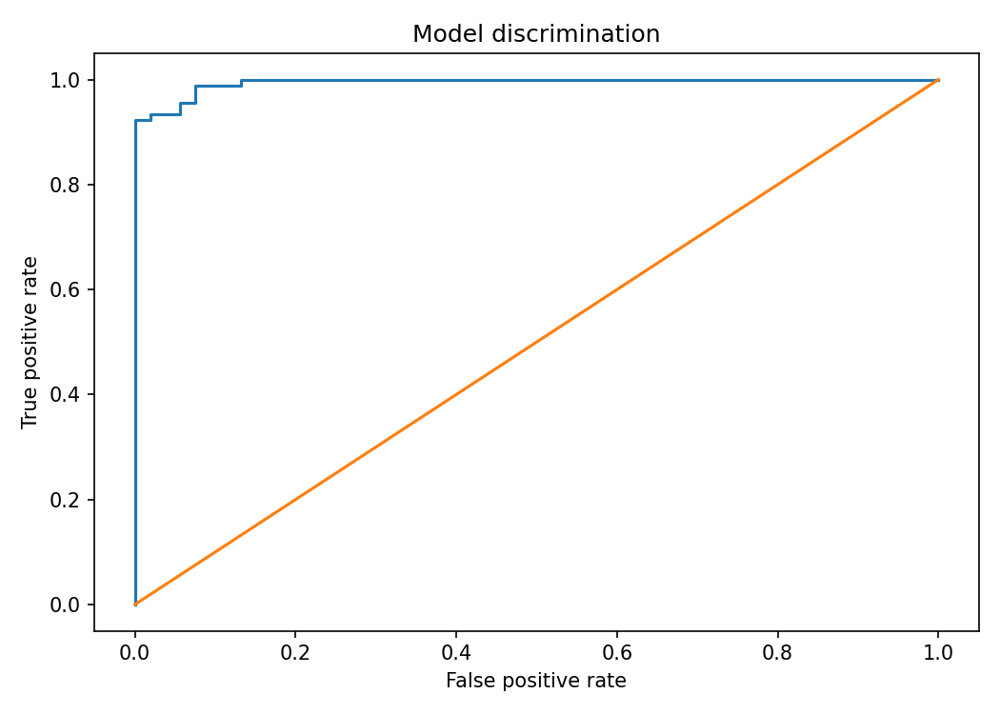

# Web Portfolio Entry — Explainable AI

**Track:** AI Engineering  
**Difficulty:** ★★★★  
**Dataset:** Wisconsin Diagnostic Breast Cancer dataset

Train a nonlinear classifier and inspect held-out permutation importance and probability behavior.

## Four-image gallery

**Skills:** XAI, permutation importance, random forest, interpretability
