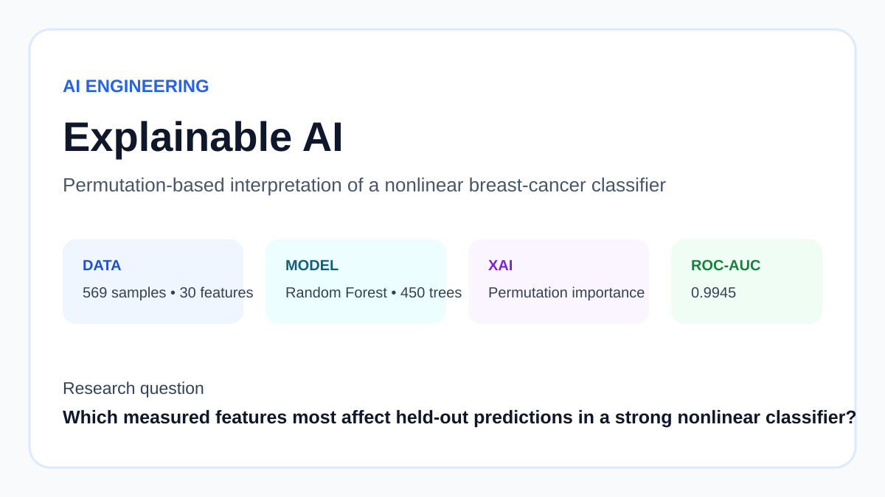
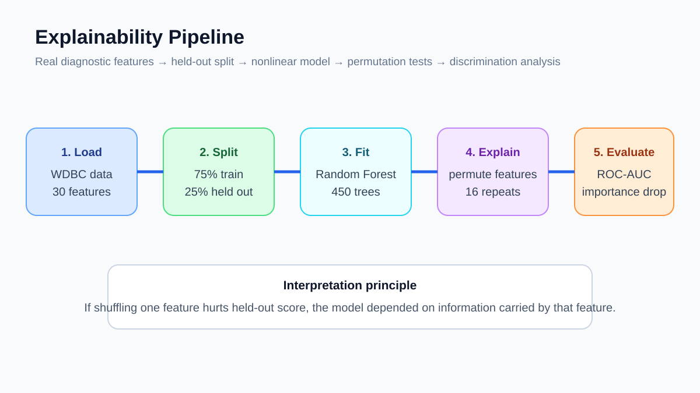
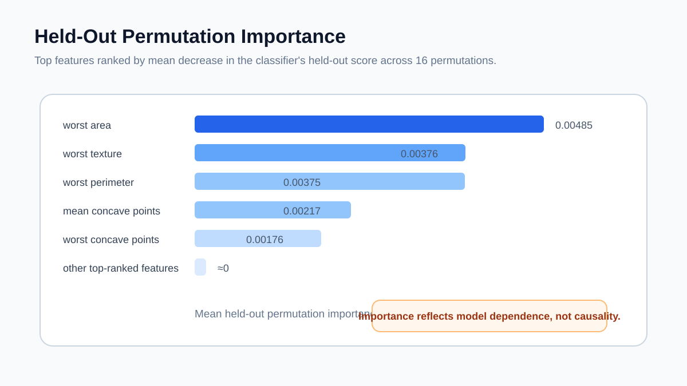

# Web Portfolio Entry — Explainable AI

**Track:** AI Engineering  
**Difficulty:** ★★★★  
**Dataset:** Wisconsin Diagnostic Breast Cancer dataset

Train a nonlinear Random Forest classifier and explain its held-out behavior using repeated permutation importance.

## Four-image gallery

**Skills:** Explainable AI, permutation importance, Random Forest, ROC-AUC, model interpretability

### Portfolio copy
This project combines strong predictive performance with post-hoc interpretability. A 450-tree Random Forest reaches 0.9945 ROC-AUC on a stratified held-out split, while 16-repeat permutation importance measures which diagnostic features the fitted model relies on most. The analysis explicitly distinguishes model dependence from causal explanation.
