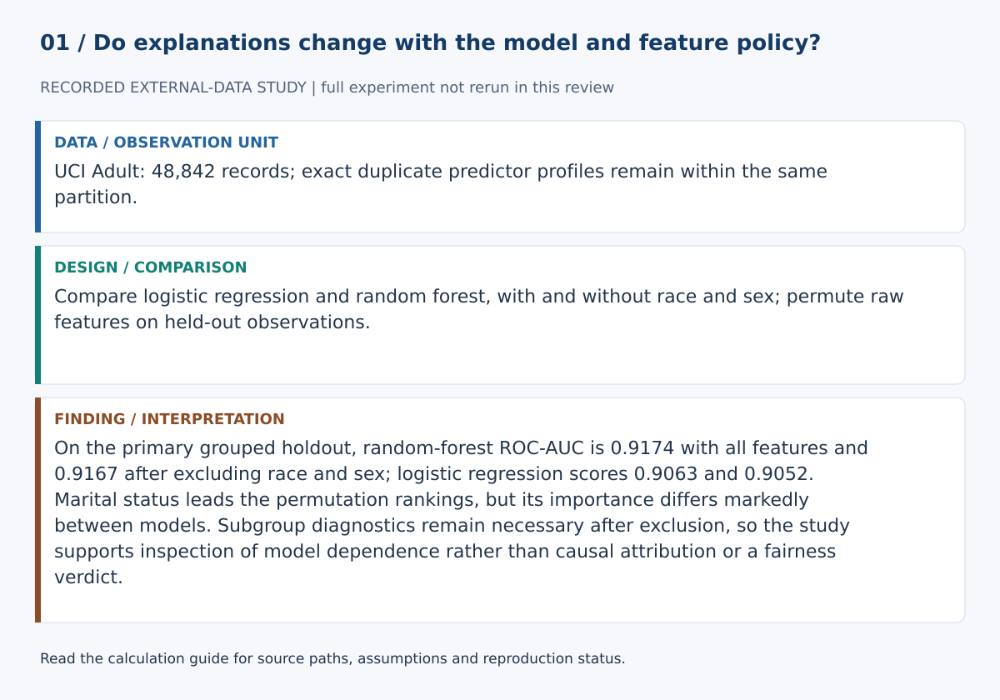
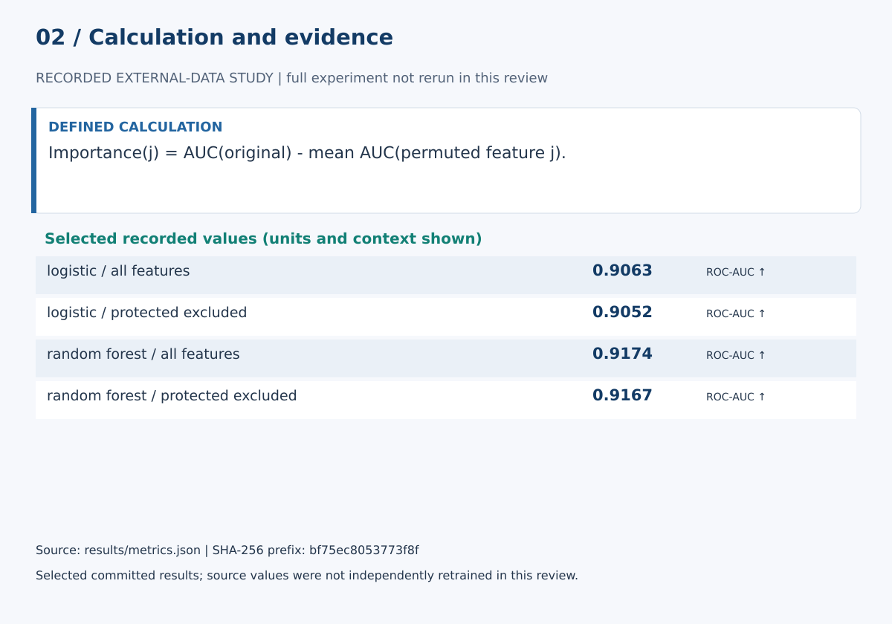

# Model Dependence, Explanation Stability and Protected-Feature Governance on UCI Adult

## Abstract

Global feature-importance plots are often presented as if they were stable properties of a dataset. This study instead treats explanations as model-, sample- and metric-dependent empirical objects. Logistic regression and random forest are evaluated on UCI Adult with and without race and sex. Held-out permutation importance, repeated permutation stability, duplicate-aware grouped holdouts, repeated split robustness, subgroup diagnostics and error analysis are used to distinguish predictive dependence from causal or fairness claims.

## Research questions

Which raw predictors support held-out discrimination in each model family? How stable are top predictors under permutation repeats? How do performance and explanations change when race and sex are excluded? What subgroup and error patterns remain?

## Data and split design

The study uses UCI Adult dataset 2. The exact UCI archive is frozen by SHA-256. `adult.data` and `adult.test` are combined for repeated robustness analysis rather than original-split benchmark reproduction.

Exact predictor duplicates are grouped before splitting. A shuffled four-fold stratified group splitter yields the primary and repeated approximately 75/25 partitions, ensuring that the same predictor vector cannot occur on both sides of a split. All preprocessing is train-only.

## Models and conditions

Logistic regression and random forest are fitted under all-feature and race/sex-excluded conditions. A class-prior dummy serves as a minimal discrimination baseline.

## Explanation analysis

Permutation importance is evaluated only on held-out observations using ROC-AUC and 16 repeats. The study records each raw predictor's mean and standard deviation of ROC-AUC drop, top-8 frequency across repeats, and mean pairwise Jaccard similarity of top-8 sets.

## Governance and subgroup analysis

Race and sex exclusion is a controlled sensitivity analysis, not a fairness certification. Both feature conditions are audited descriptively across held-out race and sex groups where sample size is adequate. Group counts plus positive and negative denominators are retained with AUC, TPR and FPR.

## Error analysis

False positives, false negatives, overall error rate and high-confidence errors are reported for the primary split.

## Results

Numerical evidence is generated to `paper/results.md`, `paper/results.tex` and `results/metrics.json`. The LaTeX manuscript imports generated results rather than duplicating values manually.

## Limitations

Adult is historical and census-derived; socioeconomic predictors are entangled; permutation explanations are model- and metric-dependent; correlated features can transfer importance; repeated grouped holdouts are dependent; and subgroup summaries do not resolve normative fairness questions.

## References

- Becker, B., & Kohavi, R. (1996). *Adult* [Dataset]. UCI Machine Learning Repository. DOI: 10.24432/C5XW20.
- Breiman, L. (2001). Random Forests. *Machine Learning*, 45, 5–32. DOI: 10.1023/A:1010933404324.
- Fisher, A., Rudin, C., & Dominici, F. (2019). All Models Are Wrong, but Many Are Useful. *Journal of Machine Learning Research*, 20(177), 1–81.

## Calculation definitions and evidence audit

Importance(j) = AUC(original) - mean AUC(permuted feature j).

Permutation importance measures dependence of a fitted predictor. Correlated predictors can redistribute importance, and shuffled combinations may be unrealistic. Removing protected attributes does not remove their proxies or establish fairness.

On the primary grouped holdout, random-forest ROC-AUC is 0.9174 with all features and 0.9167 after excluding race and sex; logistic regression scores 0.9063 and 0.9052. Marital status leads the permutation rankings, but its importance differs markedly between models. Subgroup diagnostics remain necessary after exclusion, so the study supports inspection of model dependence rather than causal attribution or a fairness verdict.

The [calculation guide](../CALCULATIONS.md) provides exact evidence paths and a function-level implementation map.

### Selected evidence and interpretation

| Quantity | Value | Unit / meaning | JSON path |
|---|---:|---|---|
| logistic / all_features | 0.9063071122512927 | ROC-AUC ↑ | `primary.models.logistic.all_features.roc_auc` |
| logistic / protected_excluded | 0.9051812271219376 | ROC-AUC ↑ | `primary.models.logistic.protected_excluded.roc_auc` |
| random_forest / all_features | 0.9173915316754124 | ROC-AUC ↑ | `primary.models.random_forest.all_features.roc_auc` |
| random_forest / protected_excluded | 0.9167075479846082 | ROC-AUC ↑ | `primary.models.random_forest.protected_excluded.roc_auc` |

These values are read from `results/metrics.json`. They must be interpreted with the split, data status and limitations above. The complete data/model experiment was not rerun in this review. Stored empirical results were inspected, not independently reproduced from raw data.

### Reproduction and claim boundaries

The existing suite requires unavailable dependencies; no full-suite pass is claimed. The figure generator can be checked with `python scripts/build_review_figures.py --check`. This verifies the displayed calculation evidence, not an independent replication of the complete scientific experiment. The manuscript is a working report, not a peer-reviewed publication.
